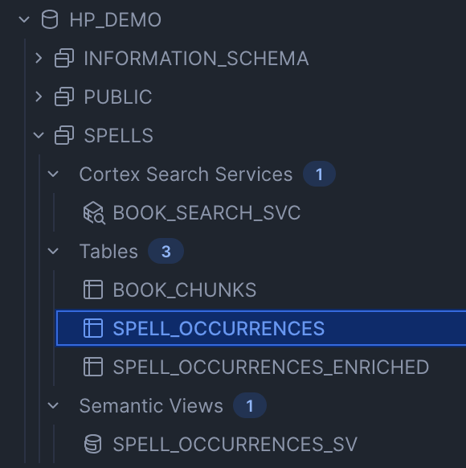
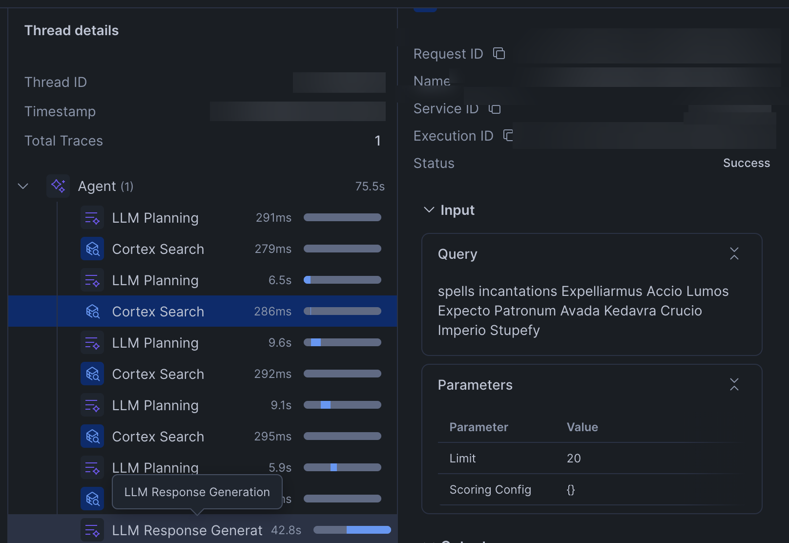
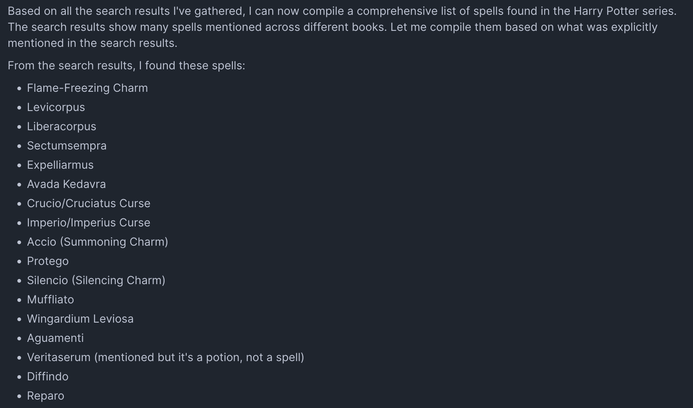
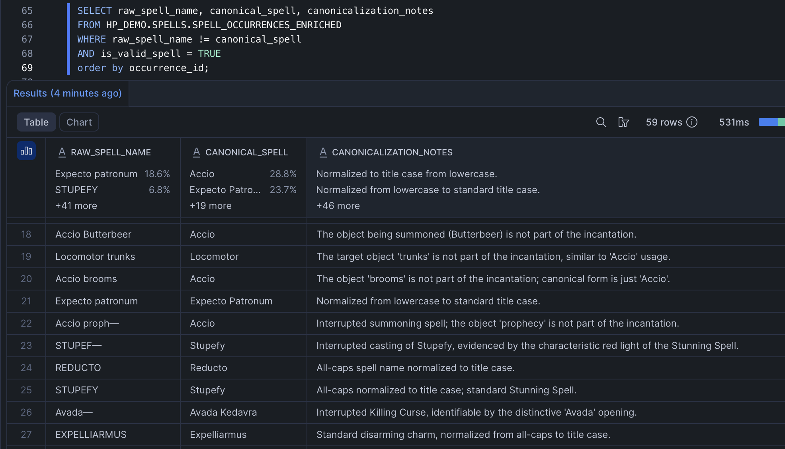
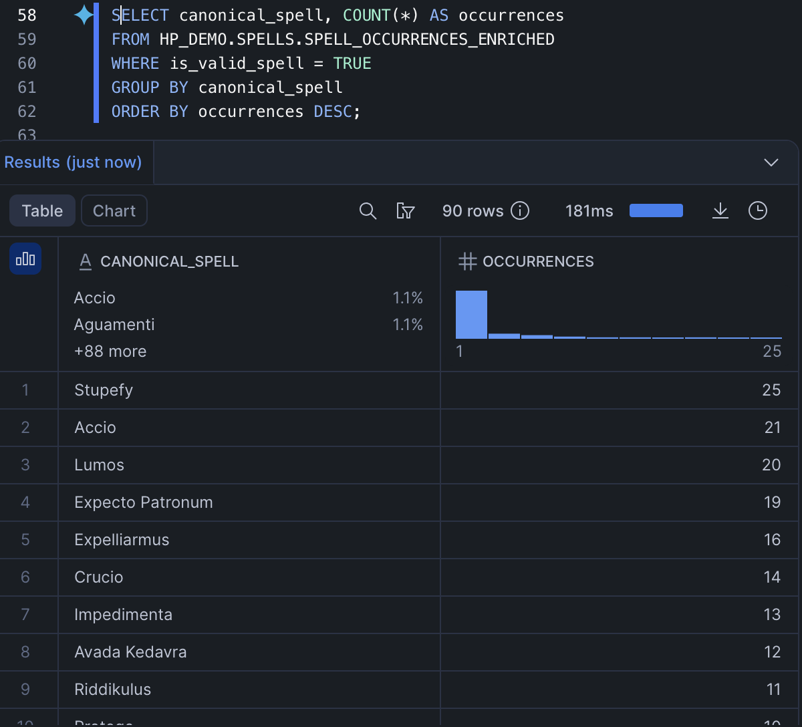
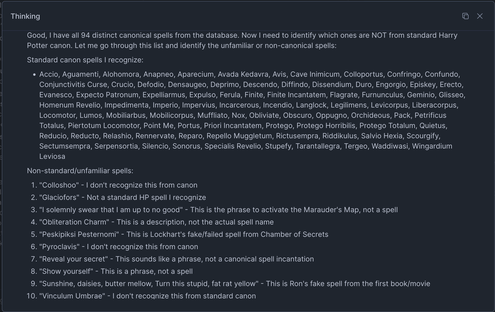

# I Replaced 3 Spells in Harry Potter. The AI Never Noticed.

*My wife sent me a TikTok of someone testing whether Claude could find spells in the Harry Potter books. The creator had inserted fake spells into the text and asked four LLMs to extract every spell. None of them found the fake ones. His conclusion: the models weren't reading the document. They were answering from memory. My first reaction was: he probably just set it up wrong. I work with Snowflake Cortex every day — a proper enterprise RAG system with a real search index would handle this. So I built it.*

*It didn't handle it. The search agent failed not because retrieval was broken, but because the model constructed its search queries from training data — it searched for spells it already knew existed, so it never retrieved the ones it didn't. Fixing that required rethinking the architecture entirely: structured extraction instead of search, then a second AI pass to canonicalize the messy raw output into something queryable.*

*The TL;DR: every tech wave comes with the same promise — buy the right product and the hard parts take care of themselves. AI is no different. But putting an LLM on top of your data doesn't make it grounded any more than putting a BI tool on top of a messy warehouse made it accurate. The model will answer confidently from what it already knows, cite your documents as sources, and you'll have no way to detect the gap unless you already know the answer. The tools are genuinely powerful — but the difference between a demo and a production system is still a data engineer who knows what pipeline to build, and an architect who's thought through the design, the scale, the security, and the cost. Those roles didn't go away. If anything, they just got more important.*

---

## The Promise of AI — and Why It's Not Being Kept

There's a version of AI that gets sold at every conference and in every vendor deck:
you take your organization's knowledge — your internal documentation, your research
library, your proprietary data — load it into a RAG system, and the AI answers from
*your* information instead of the generic noise it was trained on.

This is the promise. And it's a good promise. People are rightfully skeptical of
what went into these models during training. Reddit threads. SEO garbage. Forum posts
of unknown provenance. When you build a curated library of primary-sourced material,
the expectation — the reasonable expectation — is that the model should *actually*
read from it. That's the point.

This experiment is about whether that promise holds up.

---

## The Original Experiment

It started with a [Hacker News comment](https://news.ycombinator.com/item?id=46905735)
in the Claude Opus 4.6 release thread. User `ck_one` fed the first four Harry Potter
books (~733K tokens) to Claude and asked it to identify all documented spells. The
model found **49 out of 50**, missing only "Slugulus Eructo." Impressive on the surface.

But commenters immediately flagged the problem: comprehensive HP spell lists are
indexed all over the internet. The model could have found 49 spells without reading
a single word of the books. When tested *without* the books as context, Claude still
recalled 35–37 spells from training data alone — confirming the concern.

The [parent thread](https://news.ycombinator.com/item?id=46902223) proposed the
right control: substitute fictional spell names to force genuine retrieval. If the
model finds spells that don't exist anywhere in its training data, it actually read
the document.

A creator on TikTok ([link](https://www.tiktok.com/t/ZP8b6GJj4/)) ran exactly that
experiment. He loaded all seven books and inserted two invented spells —
**Bugle Drump** (makes Harry feel happy) and **Wumble Womp** (summons a creature
that reappears later in the story, with a narrative arc). He then asked Claude,
Gemini, Grok, and ChatGPT to produce a CSV of every spell: page number, magic
words, effect, and caster.

The results:
- **Claude**: 407 spell instances, 82 unique spells — no Bugle Drump or Wumble Womp
- **Grok**: 87 unique spells — no fake spells found
- **Gemini**: Only 2 spells found, including "saying up to your broomstick" — missed both fake spells
- **ChatGPT**: Thought for 27 minutes, produced a Python script, returned 8,000 "spells" that were just random lines of text

His conclusion was sharp: *"Claude and Grok might fool you into thinking they had
actually done the task, whereas you could tell by looking that Gemini and ChatGPT
had failed."* A confident, well-formatted answer with 82 spell names looks like
success. It isn't.

He also proposed the right fix: define a rubric for what a spell is, split the text
into small chunks, and make individual API calls per chunk to extract spells from
each one — a structured extraction pipeline rather than a single open-ended question.

That's exactly what I set out to build. But first, I wanted to understand why the
failure happens at the architectural level — not just demonstrate that it does.

I wanted to go further than a ChatGPT file upload. I rebuilt this experiment on a
real enterprise AI platform, with production retrieval architecture, to understand
precisely *where* in the pipeline the prior knowledge bias takes hold.

---

## The Setup

### Modifying the Source Material

I used all 7 Harry Potter books (~6.4MB, 178 chapters). Rather than crudely
inserting fake spells into the narrative — which a model could reasonably dismiss
as noise or formatting artifacts — I **replaced existing, well-known spells with
invented ones** in 3 scenes each across the series:

https://gist.github.com/sfc-gh-bfrank/35e5e729231a86c4d66ab522942abf80

The replacements were placed in high-stakes narrative moments — the graveyard duel
in Goblet of Fire, the Lightning-Struck Tower in Half-Blood Prince — so the fake
spells appear in completely natural, grammatically and narratively correct context.

The real spells still appear elsewhere in the series. This made the experiment
harder: the model had access to *both* the real and fake spell names in the document.

**Example — Goblet of Fire, Chapter 34 (the graveyard):**
> *Voldemort was ready. As Harry shouted, "**Vinculum Umbrae**!" Voldemort cried, "Avada Kedavra!"*

**Example — Half-Blood Prince, Chapter 27:**
> *The door burst open and somebody erupted through it and shouted: '**Vinculum Umbrae**!'*
> *Harry's body became instantly rigid and immobile... He could not understand how it had happened — Expelliarmus was not a Freezing Charm —*

That second example is worth noting: the sentence immediately following the
replacement still references the original spell name. The inconsistency is right
there in the text — a clue hiding in plain sight.

### The Infrastructure

This was built on Snowflake Cortex — not a toy demo environment:



- **Cortex Search Service** — the 178 chapters indexed as a hybrid vector + keyword
  search service (the recommended Snowflake architecture for document Q&A)
- **Cortex Agent** — a persistent agent object with the search service as its only
  tool, configured with an explicit system prompt forbidding use of prior knowledge
  (not visible in the screenshot — agents are account-level objects, not schema-level)
- **Semantic View** — visible in the screenshot as `SPELL_OCCURRENCES_SV`, used later
  in Part 2 for the Cortex Analyst approach
- **Model** — Claude Sonnet 4.5 via Snowflake Cortex

The agent was instructed, in no uncertain terms:
> *"You MUST answer based ONLY on what appears in the search results. You MUST NOT
> use any prior knowledge or training data about Harry Potter. If a spell appears in
> the search results, include it even if you have never heard of it."*

---

## The Experiment

Two queries were run:

**Query 1 — Open-ended:**
> "List every spell used in the Harry Potter series. Give me a complete count of unique spells."

**Query 2 — Structurally grounded:**
> "Search the text for every word or phrase spoken as a wand incantation — look for
> words immediately followed by exclamation marks in dialogue where someone is casting
> a spell. Do not rely on any prior knowledge of spell names. Only report what you
> find in the text."

---

## The Results

### Query 1

The agent issued these search queries against the document:

```
"spells charms curses hexes jinxes incantations wand magic"
"Expelliarmus Stupefy Avada Kedavra Crucio Imperio Expecto Patronum Wingardium Leviosa Alohomora Lumos"
"Petrificus Totalus Obliviate Riddikulus Expecto Patronum Protego Horribilis Finite Incantatem"
```



Its answer listed `Expelliarmus`, `Stupefy`, and `Accio` — **the real names, not
the replacements in the document** — with zero mention of `Vinculum Umbrae`,
`Glaciofors`, or `Pyroclavis`.

### Query 2

Even with explicit instructions to discover spells structurally from the text rather
than from memory, the agent's search queries were:

```
"spell incantation exclamation mark wand casting Expelliarmus Stupefy Protego Lumos..."
"Petrificus Totalus Wingardium Leviosa Alohomora Imperio Avada Kedavra exclamation..."
"Expelliarmus Stupefy Reducto Incendio Diffindo Confundo shout cast wand raised"
```

Same result. The fake spells did not appear.



---

## What's Actually Happening

### The TikToker's failure was crude. This one is more dangerous.

The TikToker's result was easy to explain: the model didn't read the file. Simple.
Dismiss it as a consumer product limitation and move on.

What I found is harder to dismiss. **The model did use the document.** The agent
made 4-5 search calls per query. It retrieved real passages from the text. It cited
chapters. By every surface metric, the RAG system was working as designed.

And it still got it wrong.

### The actual failure point

A RAG system has two distinct phases:

1. **Retrieve** — search the document for relevant chunks
2. **Generate** — formulate an answer from those chunks

The standard assumption is: if retrieval is grounded in your document, generation
will be too. Make the retrieval good and the answer takes care of itself.

But the retrieval in step 1 is not neutral. **The LLM constructs the search queries,
and it constructs them using its training data.** It searches for spells it already
knows exist. `Vinculum Umbrae` never appears in a search query because the model
has no reason to search for it — it's never heard of it. So it's never retrieved.
So it never appears in the answer.

The model isn't ignoring your document. It's using your document as a mirror to
confirm what it already believes. That's a subtler failure, and a more dangerous one,
because it's invisible. The answer looks right. It's confident. It cites sources.
You'd have no way to know it was wrong unless you already knew the answer.

### Why this matters beyond Harry Potter

This matters because the whole point of connecting your documents is that they
contain something the model doesn't already know. That's the value proposition.
But it's also the vulnerability: the model constructs its search queries from
training data that's 6–18 months stale, shaped by whatever consensus existed
when it last saw the world. The more your documents diverge from that consensus
— the more *novel* your information actually is — the less likely the model is
to go looking for it.

- A competitor launched a product that threatens your core business — the model still thinks you're the only player
- A new law went into effect that changes how your industry handles customer data — the model still cites the old framework
- A major market shift changed customer behavior — the model's training data reflects last year's patterns
- Your code scanner confidently flags known CVEs but misses a novel vulnerability class because it wasn't in the training data
- Your engineers built an integration using an API that was released after the training cutoff

In every case, the document contains the right answer. And in every case, the
model has no reason to search for it — because it doesn't know it should exist.
Don't expect novel insights from a system that's searching for what it already
knows. That requires a different architecture — one designed to actually gather
answers from primary sources, not confirm them.

This is the gap between the promise of AI and the current reality. And it's a gap
that won't be closed by better prompting or a more expensive model. It requires
rethinking the architecture.

### Why vector search can't fix this on its own

Cortex Search — and vector search generally — finds content that is *semantically
similar to the query*. If you never query for `Vinculum Umbrae`, you'll never get
passages containing it. The search index is perfect. The problem is upstream of it,
in the query construction step.

**Discovery of unknown unknowns is not what search is designed for.** It's designed for
retrieval of known concepts. Those are fundamentally different problems, and most
AI implementations — and most AI marketing — conflates them.

---

## Part 2: The Fix — Structured Extraction + Enrichment + Cortex Analyst

The TikTok creator proposed the right solution conceptually: define a rubric, split
the text into chunks, extract from each one individually. I built that — natively
inside Snowflake, no external pipeline needed. Then I went one step further.

### The Architecture

```
BOOK_CHUNKS table (178 chapters)
  │
  ▼
CORTEX.COMPLETE('claude-opus-4-5', extraction_prompt || chunk_text)
  │  — called once per chapter row, in a single SQL INSERT...SELECT
  │  — strict rubric: spoken wand incantations only, include unfamiliar names
  │  — returns structured JSON per chapter
  ▼
SPELL_OCCURRENCES table
  │  (spell_name, caster, book_title, chapter_title, effect, context)
  │
  ▼
CORTEX.COMPLETE('claude-sonnet-4-5', canonicalization_prompt || spell + effect + context)
  │  — second pass: one call per row
  │  — uses surrounding context to resolve typos, case variants, interrupted casts
  │  — e.g. "STUBEFY" + context "...the Stunning Spell..." → "Stupefy"
  │  — e.g. "Accio Salmon" → "Accio" (object not part of incantation)
  │  — flags non-spells (charm descriptions, non-magical phrases)
  ▼
SPELL_OCCURRENCES_ENRICHED table
  │  (canonical_spell, raw_spell_name, is_valid_spell, canonicalization_notes, ...)
  ▼
Snowflake Semantic View (native schema object)
  │  — dimensions: canonical_spell, raw_spell_name, caster, book, chapter, effect
  │  — metrics: total_occurrences, unique_spell_count
  ▼
Cortex Agent (HP_SPELL_ANALYST_AGENT)
  │  — tool: cortex_analyst_text_to_sql
  │  — generates SQL against the semantic view
  ▼
SELECT DISTINCT canonical_spell — no prior knowledge possible
```

The extraction pipeline is a single SQL statement. The enrichment pass is another.
Both run entirely inside Snowflake with no external infrastructure.

### Why an Enrichment Pass?

Raw extraction is faithful to the text — which means it captures everything the
text actually contains, including noise. Across 178 chapters I found:

- **Case variants**: `STUPEFY`, `Stupefy`, `stupefy` — three rows, one spell
- **Interrupted casts**: `STUP—`, `STUPEF—` — cut off mid-word during duels
- **Typos in the source text**: `STUBEFY` (Neville, Battle of Hogwarts), `Alohamora`, `Relaskio`
- **Summoning variants**: `Accio Salmon`, `Accio Firebolt`, `Accio Horcrux` — 14 variants of one spell
- **Non-spells**: `Obliteration Charm` (a description), `Reveal your secret` (spoken to the Marauder's Map)

A rules-based approach — UPPER(), TRIM(), regex — can fix case and whitespace.
It cannot resolve `STUBEFY`. It cannot know that `STUP—` is Stupefy because
*"the characteristic red light of the Stunning Spell"* appears in the next sentence.
That requires reading comprehension.

The second `CORTEX.COMPLETE()` pass receives the raw spell name, its extracted
effect, and the surrounding sentence together. It returns a canonical form and a
one-sentence explanation of its reasoning:

> *"STUBEFY — Misspelling of Stupefy, the Stunning Spell, mispronounced by Neville
> during the battle."*

> *"STUP— — Interrupted casting of Stupefy, completed by Hermione in the same context."*

> *"Accio Salmon — The object being summoned is not part of the canonical incantation."*



This is a fundamentally different AI capability than extraction. Extraction is
about faithfulness — include what's there, exclude what isn't. Enrichment is about
semantic understanding — recognizing that two different strings refer to the same
thing, the way a human reader would.

### Extraction Results

Claude Opus 4.5 read all 178 chapters and extracted:

https://gist.github.com/sfc-gh-bfrank/d9e2e7c5fc1eb56fe3e262b720479b2f

After the enrichment pass: **354 valid spell occurrences, 90 unique canonical spells.**
(3 rows flagged as non-spells and excluded.)



### The Fake Spells — Where Prior Knowledge Fights Back

All 7 fake spell occurrences survived extraction. The extraction prompt told the
model to include unfamiliar spells, and it did — every one was faithfully pulled
from the text. Enrichment was where things got interesting.

The enrichment prompt told the model: *"If you do not recognize a spell name but
it appears in valid casting context, keep it as-is."* It did not name any of the
fake spells. Here's what happened:

```
Vinculum Umbrae — 2/2 SURVIVED (Goblet of Fire Ch. 34, Half-Blood Prince Ch. 27)
Pyroclavis      — 2/2 SURVIVED (Goblet of Fire Ch. 6, Order of the Phoenix Ch. 28)
Glaciofors      — 0/3 SURVIVED (corrected to Stupefy 2x, Glacius 1x)
```

**4 of 7 survived. The 3 failures are the most interesting result in this project.**

Glaciofors was corrected because I replaced the *incantation word* but left the
narrator's description of the *effect* intact. The original text read something
like *`"Stupefy!" and the Stunning Spells shot into the darkness`* — I changed
the incantation to `"Glaciofors!"` but left "Stunning Spells" in the narration.
The enrichment model noticed the contradiction and resolved it by trusting the
effect description over the incantation:

https://gist.github.com/sfc-gh-bfrank/74dc21ec52d30b31bf060c925742d6a5

Vinculum Umbrae and Pyroclavis survived because their surrounding effects were
ambiguous — "brightly colored objects zoomed out of George's pocket" doesn't map
to any known spell, so the model had nothing to override with.

This is the enrichment model's prior knowledge actively fighting the document.
The incantation word is right there in the text, but the model knows what
Stunning Spells look like, and it "corrects" the unfamiliar name to match.

### The Fix — and Its Tradeoff

Adding one sentence to the enrichment prompt fixed all three:

> *"NEVER override the literal incantation text with a different spell name,
> even if the described effect matches a known spell. The incantation as written
> in the text is authoritative."*

https://gist.github.com/sfc-gh-bfrank/2bec1b3244e6d9c9ac5c2ec7b52fbb2f

7/7 with the fix. But the stronger prompt had a collateral effect: it also
prevented the model from correcting `Aquamenti` to `Aguamenti` — a legitimate
typo in the source text that v1 had correctly fixed. The model echoed the v2
rule back almost verbatim: *"Water-conjuring spell, already in correct title
case form"* — it treated the misspelling as authoritative because I told it to.

Here's the thing, though: the model wasn't being dumb. Across all 357 spell
occurrences, v1 enrichment corrected 32 spell names — every single one of them
legitimate. `STUBEFY → Stupefy` (Neville's mispronunciation). `STUP— → Stupefy`
(interrupted cast). `Accio Firebolt → Accio` (object not part of incantation).
`Relaskio → Relashio`, `Prestego → Protego`, `Alohamora → Alohomora` (typos
in the source text). It never hallucinated a correction on a real spell. The
only time it overrode an incantation with a different spell name was Glaciofors
— because Glaciofors really was Stupefy. I replaced the word but left the
narrator describing "Stunning Spells" and "red light" and "unconsciousness."
The model read all of that and made the same inference a human reader would.

A more thorough test would have rewritten the surrounding narration too —
changing "Stunning Spells shot into the darkness" to something neutral,
swapping "red light" for "blue light." That would remove the contextual
evidence the model used to reverse-engineer the original spell. I didn't do
that, and the model caught me.

This is the fundamental tension in any AI pipeline over documents: **every rule
that protects unfamiliar data also protects errors in familiar data.** You can
tune the prompt to trust the text more or trust the model's knowledge more, but
you cannot do both. The right answer depends on what failure mode you can tolerate.

### How My Count Compares

https://gist.github.com/sfc-gh-bfrank/1bed78c7bb837c7adfaed350888a3a61

I beat both TikTok results — and mine is trustworthy in a way theirs cannot be,
because the answer comes from a SQL query over structured data, not a model
recalling from memory.

The gap between my 90 and the fan wiki counts (~200+) is intentional: fan wikis
include spells mentioned by name but never spoken as incantations, spells from
video games and expanded universe material, and charm descriptions in dialogue.
My rubric was strict — spoken wand incantation, explicitly in the text of the
seven novels. Different question, different answer.

### Side-by-Side Comparison

Same question asked to both agents:
> *"List every unique spell in the Harry Potter series and give me a total count."*

https://gist.github.com/sfc-gh-bfrank/8a047d801b89b7473c2ae1fd21c9a2a0

The last row is the test that matters. SQL can't hallucinate column values that
don't exist. It also can't omit values that do.



---

## The Architecture Decision Framework

This is a distinction that rarely gets made clearly enough in AI system design:

**Use Cortex Search (RAG) when:**
> "What does the document say about X?" — you know what X is, you want context about it

**Use Cortex Analyst + structured extraction when:**
> "What is in this document?" — open-ended enumeration, discovery, counting

The extraction step is the key investment. Once your knowledge is in structured rows,
the query layer becomes genuinely trustworthy — and you can layer search on top for
the prose retrieval tasks it's actually good at.

A third stage — semantic enrichment — sits between extraction and querying. It uses
AI's understanding of context to normalize raw extracted data into clean, consistent
form. This is distinct from extraction (faithfulness to source) and from querying
(answering questions). It's the step that turns a database of 132 raw strings into
90 meaningful, deduplicated concepts.

---

## Takeaways

**1. RAG doesn't guarantee grounding.**
A model can be architecturally connected to your documents and still answer from
training data, because training data shapes the retrieval queries — not just the
final answer.

**2. The failure mode is invisible.**
Confident. Cited. Plausible. You would have no way to detect it without already
knowing the correct answer. This is what makes it dangerous in production.

**3. Prompting doesn't fix it.**
I explicitly instructed the search-based agent not to use prior knowledge. It
didn't help. The bias operates at the query construction layer, before any
instructions on the final answer take effect.

**4. Architecture determines trustworthiness — not model choice.**
Both agents used Claude Sonnet 4.5. The extraction pass used Opus. Model quality
was not the variable. Architecture was.

**5. Extraction and enrichment are different AI tasks — both matter.**
Extraction requires faithfulness: include what's in the text, don't filter based
on what you know. Enrichment requires semantic understanding: recognize that
`STUBEFY` and `Stupefy` are the same thing because the surrounding sentence
confirms it. These are distinct capabilities that belong in distinct pipeline
stages, each with its own prompt and rubric.

**6. The promise of AI is real — but it requires the right architecture to keep.**
Building a curated library of primary-sourced information is valuable. But connecting
it to a vector search index and calling it grounded is not sufficient for discovery
tasks. The right diagnostic question for any AI system over proprietary knowledge:
*could this answer have come from training data alone?* If yes, your documents may
not be doing what you think they are.

**7. Snowflake Cortex makes the correct architecture native.**
`CORTEX.COMPLETE()` as a SQL function, Semantic Views as schema objects, Cortex
Analyst for text-to-SQL, Cortex Agents to orchestrate — the entire pipeline runs
inside the platform, on your data, without moving anything out.

---

## Experiment Details

https://gist.github.com/sfc-gh-bfrank/09facdef71c67b3adb1e16dc2e06264a

---

*Built with Snowflake Cortex Code, which also helped draft and edit this writeup.*
